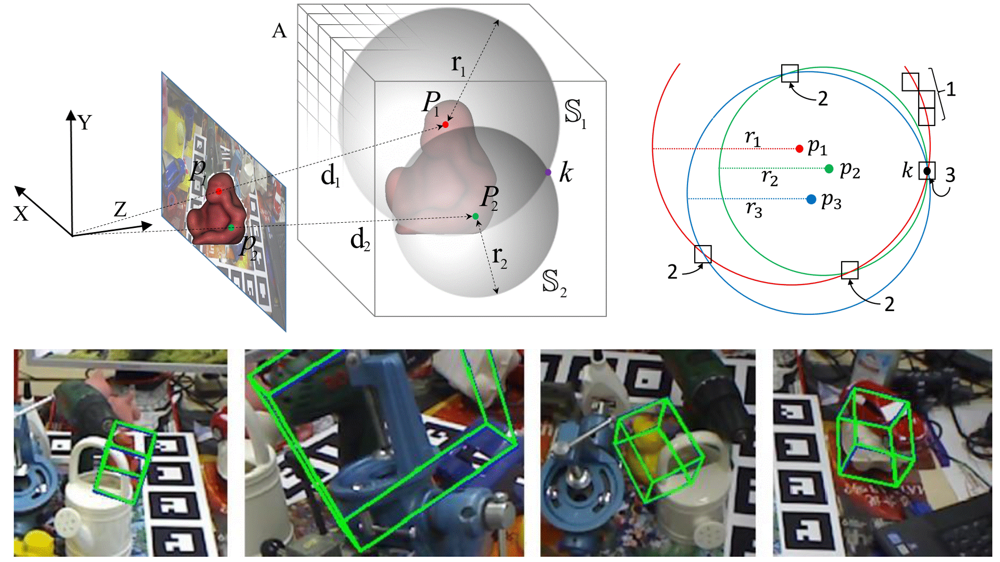

# RCV(Radial Keypoint Voting) Pose



> [Vote from the Center: 6 DoF Pose Estimation in RGB-D Images by Radial Keypoint Voting](https://arxiv.org/abs/2104.02527 "arxiv")
> Yangzheng Wu, Mohsen Zand, Ali Etemad, Michael Greenspan
> ECCV 2022

## Prior to Usage

In order to use this repo, the environement and datasets need to be prepared and downloaded.

The code has been run and tested on both `Windows(10,11)` and `Linux(22.04)`, not `Mac OS`.

### Dependencies

Install PyTorch prior to other python packages:

Follow the official installation guidance of [PyTorch](https://pytorch.org/) and [Nvidia](https://docs.nvidia.com/cuda/index.html), and install the compatibale version of both [cuda](https://developer.nvidia.com/cuda-downloads) and [PyTorch](https://pytorch.org/get-started/locally/) for the GPU.

Install the rest dependencies by using conda:

```
conda create --name rcvpose --file requirements_simplified.txt
```

or pip:

```
pip install requirements_simplified.txt
```

[requirements.txt](https://github.com/aaronWool/rcvpose/blob/main/requirements.txt) is the output of `conda list` command, if the simplified_requirements.txt missed anything, this list can be tried.

### LINEMOD Dataset

Download [LINEMOD](https://zjueducn-my.sharepoint.com/:u:/g/personal/pengsida_zju_edu_cn/EXK2K0B-QrNPi8MYLDFHdB8BQm9cWTxRGV9dQgauczkVYQ?e=beftUz), [LINEMOD_ORIG](https://zjueducn-my.sharepoint.com/:u:/g/personal/pengsida_zju_edu_cn/EXK2K0B-QrNPi8MYLDFHdB8BQm9cWTxRGV9dQgauczkVYQ?e=beftUz) and [Occlusion_LINEMOD](https://zjueducn-my.sharepoint.com/:u:/g/personal/pengsida_zju_edu_cn/ESXrP0zskd5IvvuvG3TXD-4BMgbDrHZ_bevurBrAcKE5Dg?e=r0EgoA) from PVNet or [BOP links](https://bop.felk.cvut.cz/datasets/).

Download [dispersed keypoints](https://queensuca-my.sharepoint.com/:u:/g/personal/16yw113_queensu_ca/EQdbKv9BHI5AiqmNaMWmpWUB-RqKf9HdM_tqN7msdtdjOQ?e=a9hNVP) and unzip it into LINEMOD root, there should exist a 'Outside9.npy' file once finished.

### Radial Map Generation

In order to train the network, radial maps are required as the GT label and they can be generated by running:

```
python 3DRadius.py
```

Based on our experiments, three keypoints are sufficient enough for optimal performance. After the radial map generation is done, there should be a series of folders named `Out_pt*_dm` within each object's folder.

##Training and Testing

The [pre-trained models](https://queensuca-my.sharepoint.com/:f:/g/personal/16yw113_queensu_ca/EmSWfjRys1tJkWdsCP4zVsIBwIwY0AXoDBVK1n51LUWK0g?e=WdabvX) can be downloaded and tested directly without training. Note that the checkpoints will only work when [PyTorch data parallel](https://pytorch.org/docs/stable/generated/torch.nn.DataParallel.html) is enabled.

## Train & Test

### Train RCVPose

For training, simply run:

```
python main.py --root_dataset="PATHTODATA" --kpt_num='1' --mode=train --batch_size=32 --optim='Adam' --initial_lr=1e-4 --resume=False
```

The code is compatibale with [multi-GPU training](https://pytorch.org/docs/stable/generated/torch.nn.DataParallel.html) and it is fully automatic.

Track the training process by using [Tensorboard](https://www.tensorflow.org/tensorboard):

```
tensorboard --logdir='PATHTOLOG'
```

Three networks are required to be trained before testin as RCVPose use one network for each keypoint.
At the project root, create a 'ckpts' folder and save the best models there.

### Test RCVPose

For testing, simply run:

```
python main.py --root_dataset="D:/Datasets/6dPoseData/LINEMOD/" --mode=test --demo-mode=False
```

Enable the demo mode if the visualization result is required.

## Citation

If our work helps your work, we respectively ask for citations:

    @inproceedings{wu2022vote,
          title = {Vote from the Center: 6 DoF Pose Estimation in RGB-D Images by Radial Keypoint Voting},
          author = {Wu, Yangzheng and Zand, Mohsen and Etemad, Ali and Greenspan, Michael},
          booktitle = {European Conference on Computer Vision (ECCV)},
          year = {2022},
          organization={Springer}
	  }

## Acknowledgement

This project is sponsored by Bluewrist Inc. and NESERC(Natural Sciences and Engineering Research Council of Canada).
